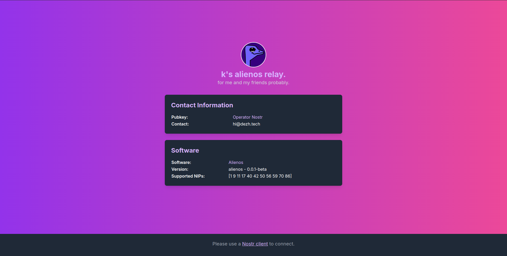

<p align="center"> 
    
</p>

<h1 align="center">
Alienos
</h1>

<br/>


The Alienos is a Nostr stack (relay/blossom mediaserver/nip-05 server) which is manageable (using nip-86) and [plugin-able](wip). We designed it for self-hosting and backups.

This project is based on [Khatru](https://github.com/fiatjaf/khatru), [Event Store](https://github.com/fiatjaf/eventstore), [Blob Store](github.com/kehiy/blobstore) and [Go Nostr](github.com/nbd-wtf/go-nostr).


## Landing Page



## Features

- [X] Support NIPs: 1, 9, 11, 40, 42, 50, 56, 59, 70, 86.
- [X] Support BUDs: 1, 2, 4, 6, 9.
- [X] NIP-05 server.
- [X] Manageable using NIP-86.
- [X] Landing page with NIP-11 document.
- [X] S3 backups (relay dbs/blobs/nip05 data/management info).
- [X] Moderator notifications.
- [X] S3 as blossom target.
- [X] Colorful Console/File logger.
- [ ] Running on Tor.
- [ ] Support plugins.
- [ ] Config, Running and plugins full documentation.
- [ ] StartOS support.
- [ ] Umbrel support.

## How to set it up?

### VPS

In this guide we explain how you can run a alienos instance on your VPS using docker and nginx or without docker.

1. Prerequisites:

This project min requirements to be run is as below:

- **CPU**: 0.5 vCore
- **Memory**: 500MB
- **Storage**: Depends on your database size.

You need to by a server form your preferred provider and obtain ssh access to it.
Its recommended to use debian/ubuntu distribution.

2. Domain name (optional): you can buy a domain name from your preferred provider to use for your relay. its recommended to do that.

3. Install Docker and Docker-compose:

```bash
sudo apt update
sudo apt install -y docker.io
sudo apt install -y docker-compose
```

4. Clone this repository:

```bash
git clone https://github.com/dezh-tech/alienos.git
cd alienos
```

5. Setup your config:

```bash
cp .env.example .env
nano .env
```

It would open a file that allows you to edit config file. Each field contains an example and comment as documentation. Make sure you read them.

> [!WARNING]
> Technical note:
> If you chained port config, don't forget to update it on docker-compose.yaml as well.

Use Ctrl+O+Enter and then Ctrl+X to save and exit.

6. Build and run:

Use this command to build and run your image:

```bash
docker-compose up --build -d
```

---

#### Setting up a domain (optional/recommended):

Using this command install nginx:

```bash
sudo apt install nginx
```

Setup your domain:

```bash
sudo nano /etc/nginx/sites-available/<your-domain.com>
```

> Replace it with your domain excluding the < and >.

Paste the [example config](nginx.conf) there and replace your domain.

Use Ctrl+O+Enter and then Ctrl+X to save and exit.

Enable the Nginx config:

```bash
sudo ln -s /etc/nginx/sites-available/<your-domain.com> /etc/nginx/sites-enabled/
```

Restart Nginx:

```bash
sudo systemctl restart nginx
```

Setup SSL (optional/recommended):

```bash
sudo apt install certbot python3-certbot-nginx
sudo certbot --nginx -d <your-domain.com>
```

Then follow the prompts and provide required info to set up the SSL.


Now your alienos server must be available using `wss://you-domain.com` and `wss://youe-ip:port`.

### Relay tools

> TODO.

### Umbrel

> TODO.

### StartOS

> TODO.

## Limitations

This project is highly suitable for personal, community, team and backup usage since its light-weight, feature-full and easy to setup/manage.

If you are aiming to run a relay/nip-05 server/blossom media server for large scale and high load (as a paid relay, default relay fo your client or a public global relay) you can consider using the [Immortal](https://github.com/dezh-tech/immortal) relay and its adjacent projects.

## Contribution

All kinds of contributions are welcome!

## Donation

Donations and financial support for the development process are possible using Bitcoin and Lightning:

**on-chain**:

```
bc1qa0z44j7m0v0rx85q0cag5juhxdshnmnrxnlr32
```

**lightning**: 

```
dezh@coinos.io
```
